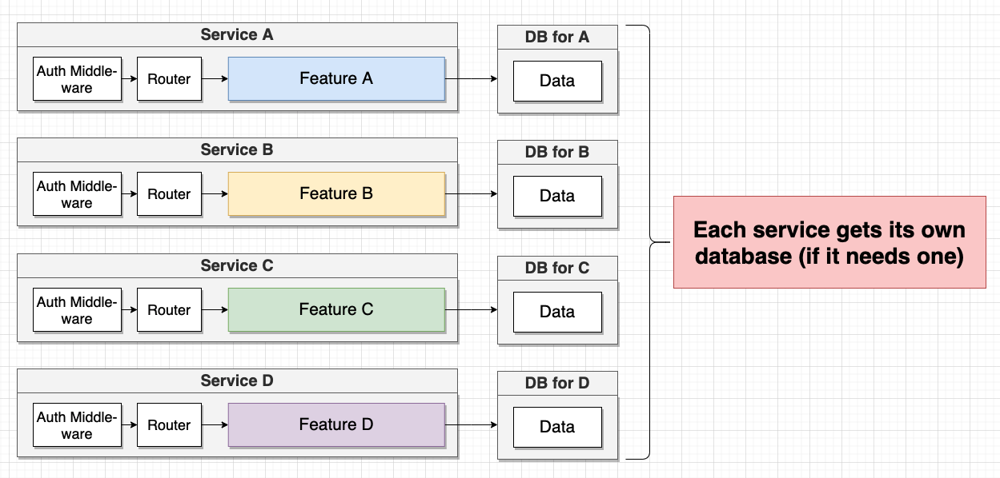
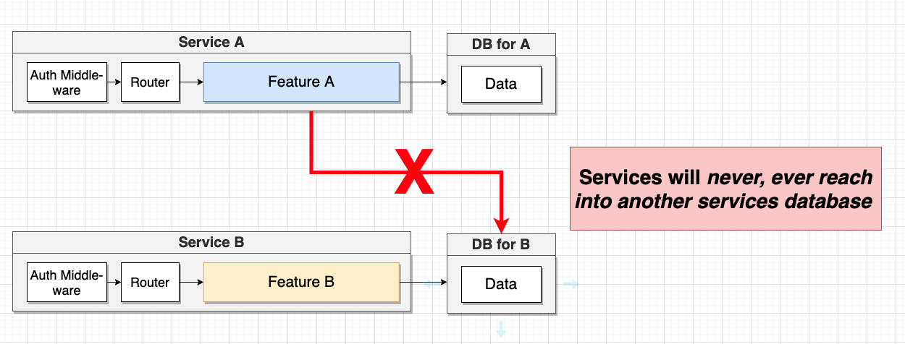
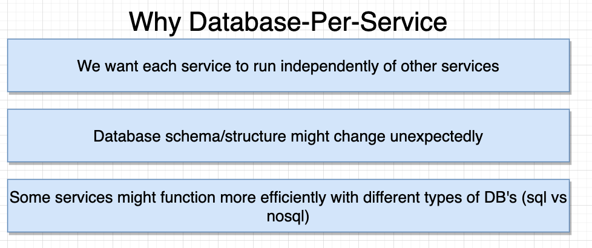

## Dados em Microserviços | Gerenciamento de dados entre serviços

Um dos grandes "problemas" a serem resolvidos quando trata-se de Microservicos, é o gerenciamento de dados entre serviços. Quando falamos de gerenciamentode dados, estamos falando em como armazenamos dados dentro de um serviço.

Esse é um dos maiores obstáculos para o uso de Microserviços.

#### Armazenar dados

Para cada serviço temos um próprio banco de dados

#### Acessar dados

Nunca devemos acessar diretamento os dados de um banco de outro serviço. 

### Padrão: Database-Per-Service

Existe um padrão responsável por garantir que o gerenciamento de dados quando utilizado microserviços seja o correto. 

