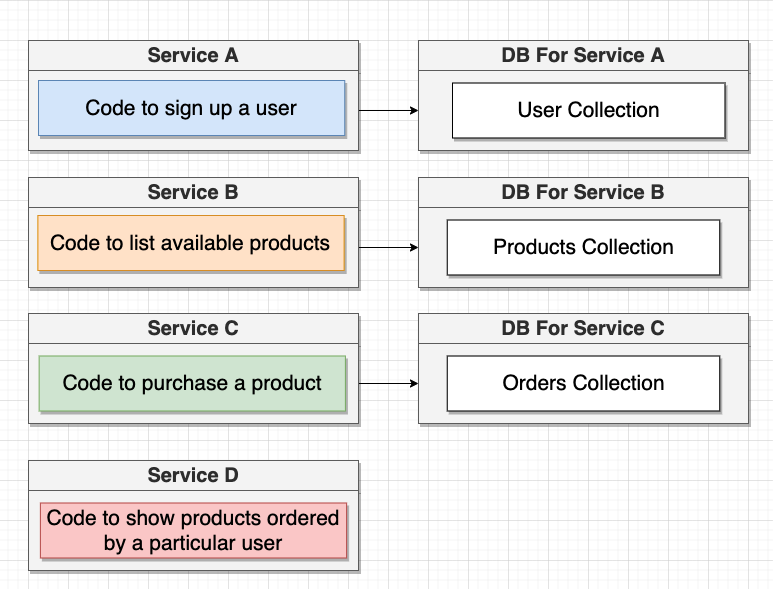

## O grande problema com dados

Um dos grandes problemas com dados quando trabalhamos com microservicos é que um serviço nunca deve acessar diretamente a base de dados de outro serviço.

Se tomarmos como exemplo a imagem abaixo, onde temos um 3 serviços com seus respectivos bancos de dados. No momento de criação de um quarto serviço que precisa de informações dos bancos desses outros 3 serviços, não devemos consultá-los diretamente. 

Existem algumas maneiras de implementarmos esse serviço sem infrigir tais regras, e aprenderemos mais sobre elas adiante.