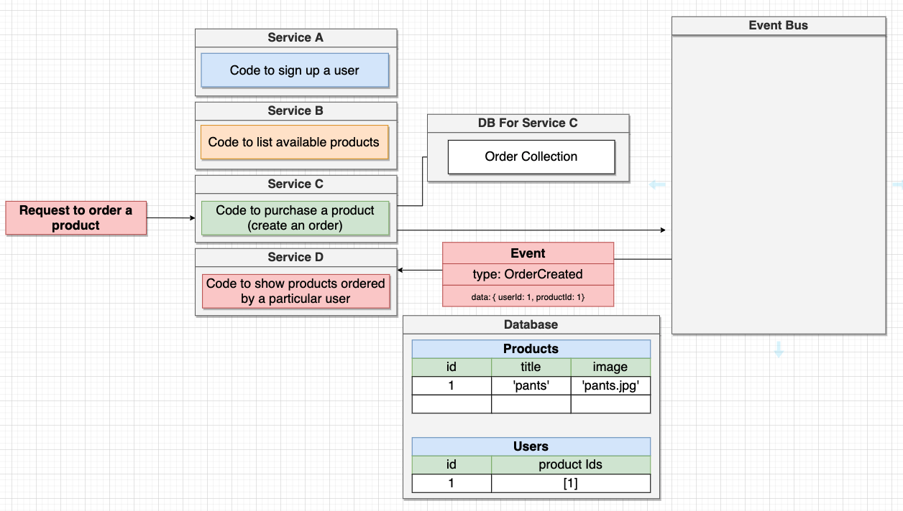

## Comunicação entre serviços

Como visto anteriormente, o grande problema quando falamos de microserviços, é o gerenciamento de dados e o fato de um serviço não poder acessar o banco de dados de outro serviço, sendo esse um padrão chamado "Database-per-Service".

Então como fazemos para ter um serviço que necessita de dados de um banco de dados de outros serviços? Bom, existem duas formas, sendo:

* Comunicação síncrona
* Comunicação assíncrona

### Comunicação síncrona

Este tipo de comunicação é a mais fácil de entender. Trata-se de requisições HTTP feitas entre os serviços, onde serviço A faz um requisição para um serviço B e recebe a resposta das informações. Nesse cenário, B continua sendo o único responsável pelas consultas no banco de dados e A apenas tem acesso ao que for retornado na requisição, que pode ser um JSON ou qualquer outro formato.

#### Observações sobre a comunicação síncrona

### Comunicação assíncrona | Event Bus

Não trata-se da melhor estratégia e geralmente é pouco utilizada pois compartilhamos dos mesmos pontos negativos da comunicação síncrona.

A comunicação assíncrona utilizando eventos trabalha com a transmissão de eventos disparados por serviços e que entrar no "Event Bus", que direciona as informações para os serviços que devem saber lidar com o evento. Então esses serviços respondem o evento e devolvem para o seu emissor original.

Existe um forma bem mais atrativa de trabalhar com comunicação assíncrona entre serviços e a veremos a seguir.

### Comunicação assíncrona | Event Bus + Database-Per-Service

Essa estratégia pode parecer a mais confusa e bizarra de todas, pois envolve comunicação baseada em eventos e um base de dados única para o serviço em questão. Vamos entender melhor com o exemplo da imagem abaixo.

__O que está acontecendo aí?__

1) Temos uma requisicão chegando em no serviço de criação de orders
2) Uma nova order é criada e salva no banco de dados de Orders do serviço C
3) Ao mesmo tempo, um evento é emitido com essa informação/dados
4) E o serviço D, o interessado na informação, recebe esse evento
5) Após receber esse evento, o serviço D salva em seu banco de dados 
6) Com isso, agora o serviço D tem tudo que precisa para retornar a informação de quais produtos um usuário comprou sem precisar consultar o banco de dados de outros serviço.