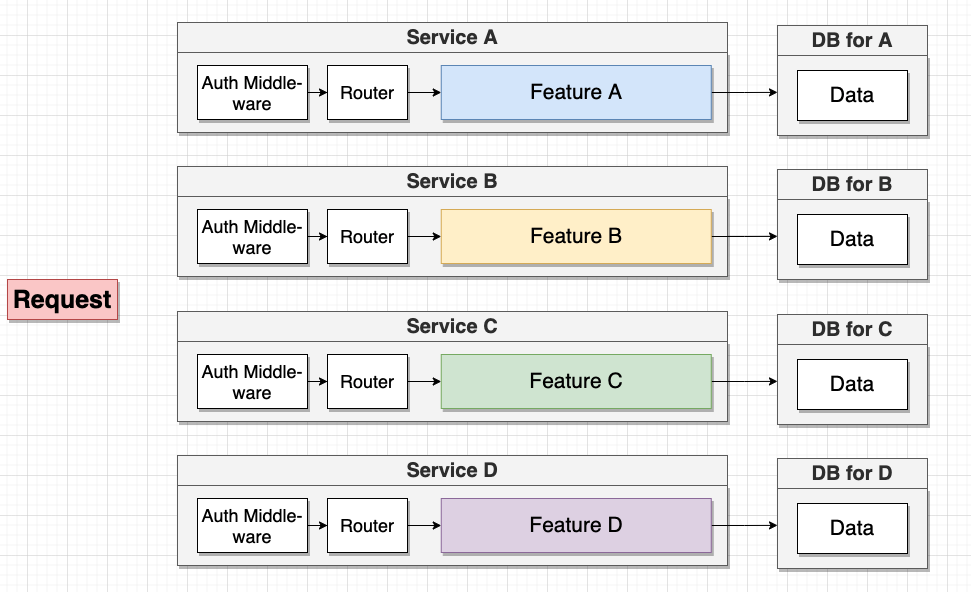
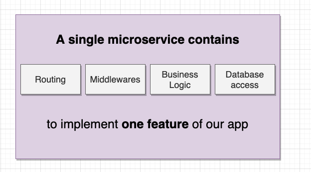

## O que é um Microserviço?

Antes de entender o que é um Microserviço, precisamos dar um passo atrás e entender a estrutura de um monolítico e porque ele pode ser uma limitação durante o desenvolvimento de nossas aplicações. 

Aplicações Monolíticas contém toda a implementação das features de uma app, compartilhando a mesma estrutura, infraestrutura e base de código. 

Já aplicações baseadas em Microserviços visam justamente quebrar as features de uma aplicação para que cada uma delas seja um novo serviço/app. 

Desas forma, nossa aplicação não fica acoplada em apenas uma estrutura, infraestrutura e base de código, o que facilita a manutenção e escalonamento. Também existe a vantagem de que caso um dos microserviços deixem de rodar, partes da aplicação continuam funcionando, diferente de uma abordagem puramente monolítica. 

Em resumo, podemos dizer que um Monolítico...

Enquanto que um Microserviço...

